# Le Frat — Burger Store & Merchandise

🔗 **Live Site:**  
https://le-frat-store-9249b463cfe0.herokuapp.com/


---

## Introduction 

Le Frat is a full-stack Django e-commerce platform developed as part of **Code Institute Project 5**.  
The project represents a burger-inspired lifestyle brand that sells exclusive merchandise, allowing users to browse products, manage a shopping bag, complete secure Stripe payments, and leave product reviews.

---

## Business Model  

Le Frat operates under a **B2C (Business-to-Consumer)** model.

The brand merges:
- Burger culture  
- Streetwear identity  
- Lifestyle branding  

###  Revenue Streams  
- Online merchandise sales (hoodies, t-shirts, accessories)  
- Limited edition drops  
- Brand collaborations and partnerships  

### Value Proposition  
Le Frat delivers **a lifestyle experience beyond food**, blending culture, exclusivity, and identity into a recognizable and scalable brand.

---

## Target Audience  

### Primary Audience  
- Ages 16–35  
- Urban, trend-aware, socially active  
- Fans of streetwear and food culture  

### Secondary Audience  
- Tourists  
- Casual shoppers  
- Brand collectors  

---

## User Experience (UX) & Design  

###  UX Goals  
- Provide a clean and intuitive shopping experience  
- Enable fast and secure checkout  
- Encourage engagement through reviews  
- Maintain strong lifestyle brand identity  
- Optimize usability across mobile and desktop  

### Design Choices  
- Minimalist layout  
- Brand-aligned typography and color palette  
- Mobile-first responsive design  
- Clear product hierarchy  
- Accessible navigation  

## Agile Development & Planning  

The project followed **Agile methodology**, with features built incrementally and tracked via a Kanban board.

###  User Stories  
- As a customer, I want to browse products easily  
- As a user, I want to securely checkout  
- As a user, I want to leave reviews  
- As an admin, I want to manage inventory  
- As a customer, I want to subscribe to a newsletter  

[User stories here:](https://github.com/users/madlp24/projects/5)

## Architecture
---
## Database
---
<details>
  <summary>Click here to view Database Schema:</summary>

  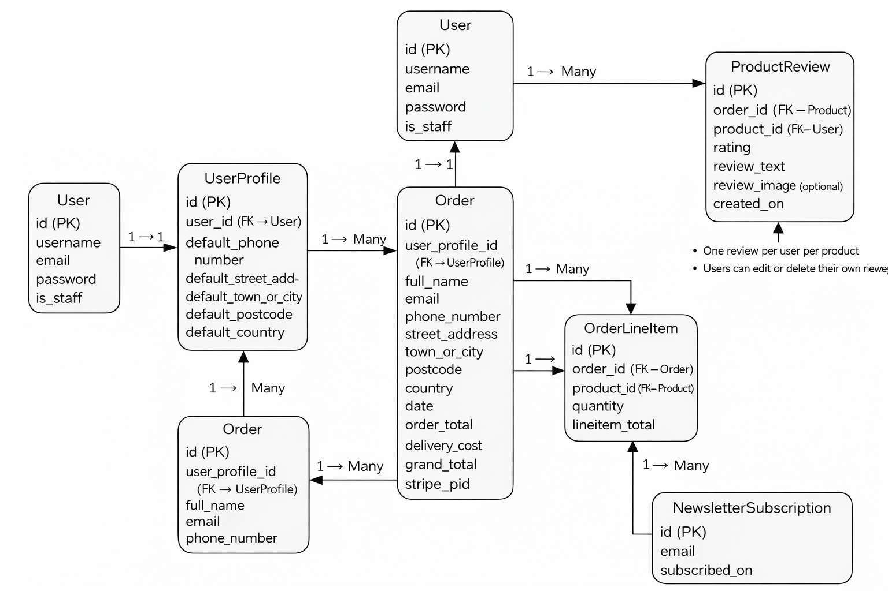

</details>

## Design
---
<details>
  <summary>Before starting any development, I created a set of wireframes to clearly define the overall layout and structure of the site. These wireframes helped me visualize how each page such as the homepage, product page, shopping bag, checkout, user profile, and admin dashboard would function and flow together. They also served as a simple but effective way to communicate my design ideas and goals to my mentor, ensuring we shared the same understanding of what I wanted to achieve before writing any code.
</summary>

  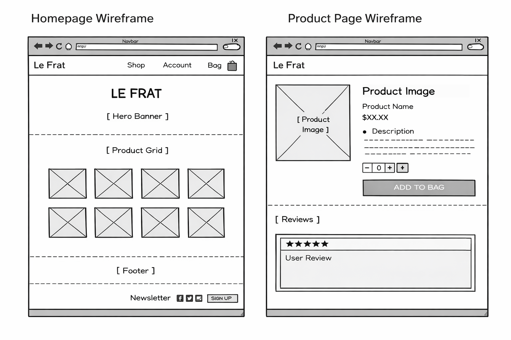
  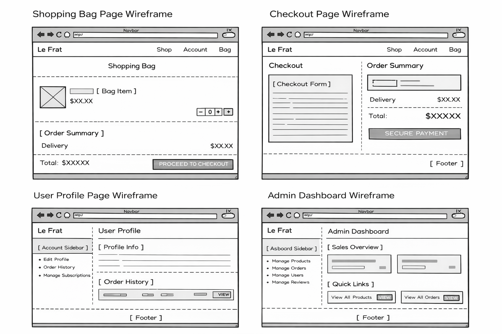

</details>

## Navigation
---
<details>
  <summary>I then created a series of flowcharts to map out the website’s structure and user journeys. These diagrams helped me visualise how users would navigate through the site—from browsing products and managing authentication to completing checkout and accessing their account—making the overall flow clearer before moving into development.
</summary>

  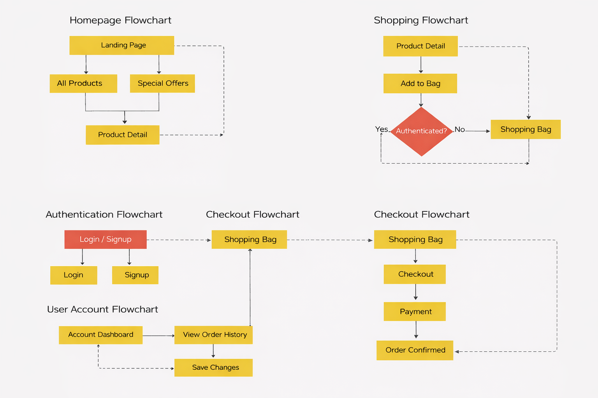

</details>

### E-commerce type

This project is a merchandise store for Le Frat, a food brand that extends its identity beyond burgers into lifestyle products. The site allows users to browse and purchase branded merchandise through a simple and intuitive shopping experience. From an administrative perspective, the platform implements full CRUD functionality to manage products, users, and orders efficiently.

### Brand Content

Le Frat is a food brand built around simplicity, authenticity, and shared experiences. Rooted in the idea that the best moments happen between friends, the brand embraces a bold yet minimal aesthetic and a relaxed, confident attitude. Its identity focuses on quality over excess, avoiding unnecessary complexity while delivering a strong and recognizable presence.

The merchandise featured on this platform extends Le Frat’s brand beyond food, allowing customers to engage with the brand as part of their everyday lifestyle. Each product reflects the same values found in the restaurant experience: simplicity, community, and character. The online store is designed to maintain this identity through clean design, straightforward interactions, and a user experience that feels effortless and approachable.

## Features

### Homepage
---
The homepage provides the main entry point to the Le Frat website, displaying the brand logo, navigation menu, search functionality, user account access, and shopping bag. A hero banner highlights the brand identity and includes a call-to-action button directing users to browse products.

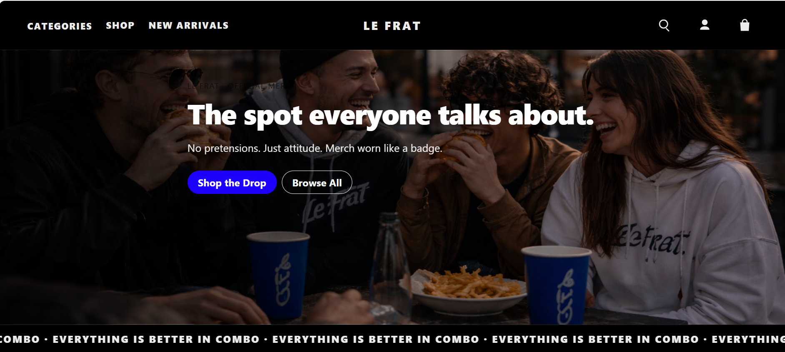

### Header & Navigation
---
The header appears across all pages and includes the Le Frat logo, navigation links, search bar, user account access, and shopping bag icon, allowing users to easily navigate the site.


### Product Listing Page
---
The products page displays all available merchandise in a responsive grid layout, allowing users to browse items, view pricing, and navigate to individual product detail pages.

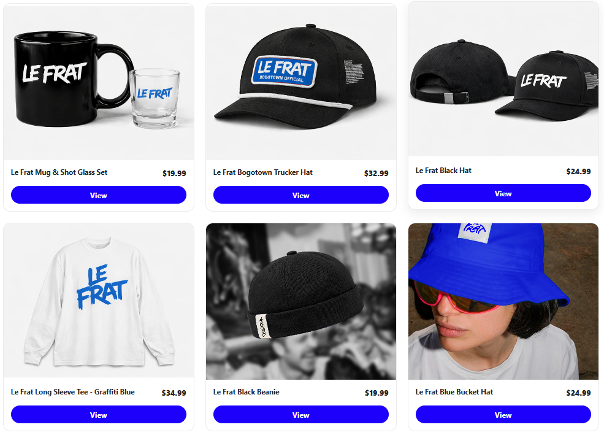

### Product Detail Page
---
The product detail page presents detailed product information including images, description, price, and an add-to-bag option. Users can also view and submit product reviews.

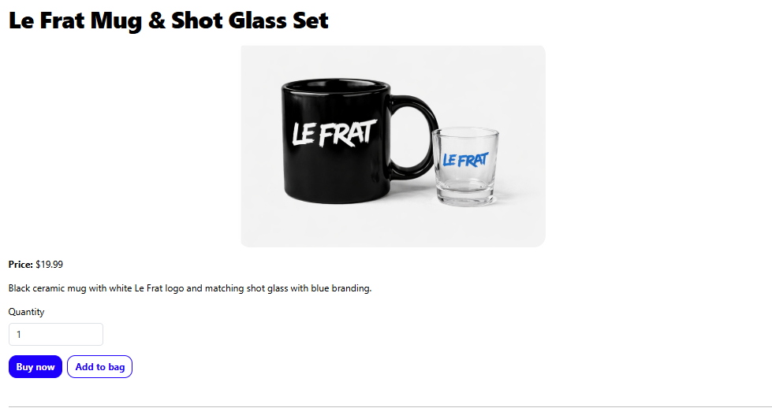

### Shopping Bag
---
The shopping bag displays selected products along with quantity controls, individual prices, and the order total. Users can update quantities or remove items before proceeding to checkout.

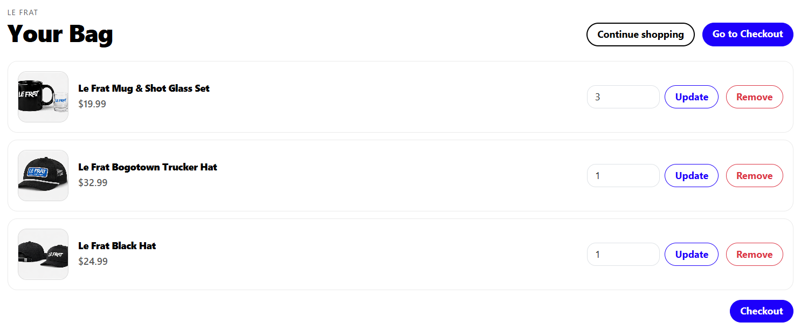

---

Also the bag items updated the quantity of products on the bag

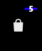


### Checkout Page
---
The checkout page allows users to securely enter delivery and contact details while reviewing an order summary before completing payment.

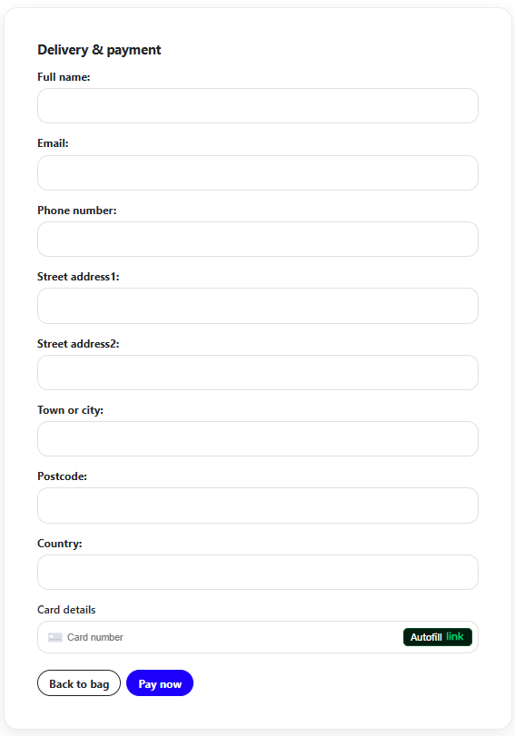

At the checkout stage, users are prompted to confirm their delivery details and enter their card information to complete payment. An order summary is displayed alongside the form, allowing users to review their items and total cost. If needed, users can return to the shopping bag to make adjustments or proceed by selecting Pay now to finalise the order.

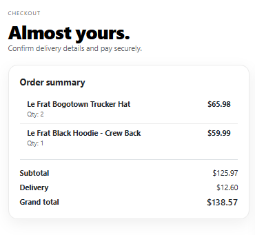

### Order Confirmation
---
After a successful payment, users are shown an order confirmation page displaying purchase details and confirmation that the transaction was completed successfully.

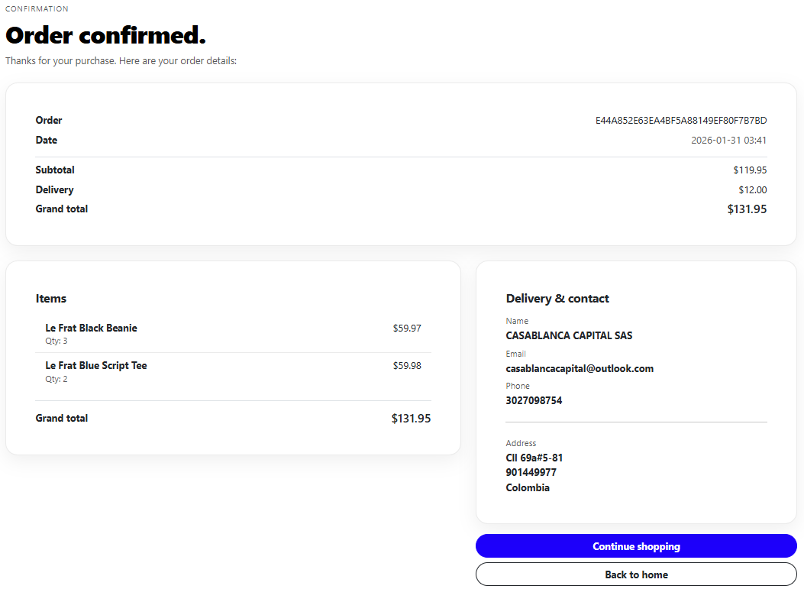

### User Registration
---
New users can create an account by registering with their email and password, allowing access to features such as order history and product reviews.

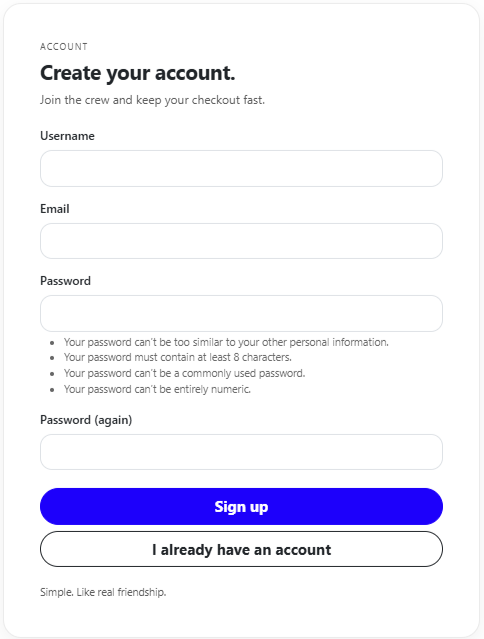

### User Login
---
Registered users can log in to access their account, manage profile details, and view previous orders.

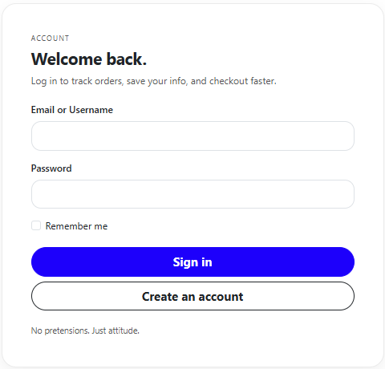

### User Profile
---
The user profile page allows customers to view and update personal information and review their order history.

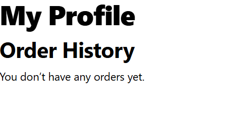

### Product Reviews
---
Users can leave reviews on products they have purchased, including a rating and optional image, helping build trust and engagement within the platform.

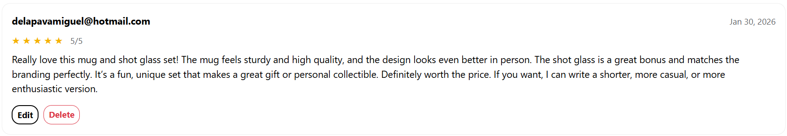

### Product management - Add Product
---
Only super users are authorized to add products to products catalogue

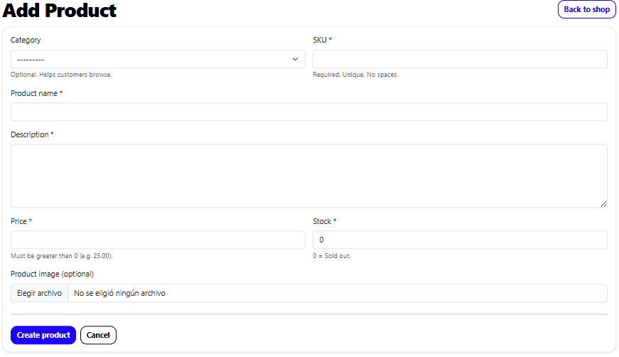

### Product management - Add Product
---
Super users have the ability to edit product details, including the name, description, category, SKU, price, and product image. An alert is displayed to confirm the action being performed, ensuring clarity before proceeding. Users can then choose to save the updated changes or cancel the action.


### Footer
---
The footer appears across all pages and provides quick access to important customer links, company information, and help resources. It also includes social media links and a newsletter subscription form, allowing users to stay informed about product drops, collaborations, and promotions.

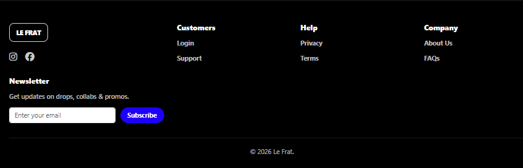

### Newsletter
---
The newsletter form enables users to subscribe for updates on promotions, product releases, and brand announcements.


### Facebook Business Page
---
The Facebook Business Page supports marketing efforts by promoting products, sharing updates, and engaging with customers.

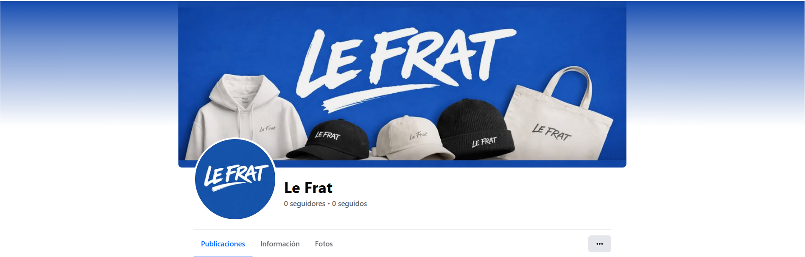
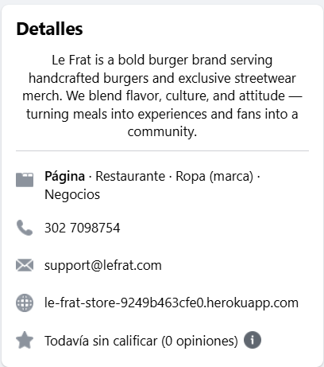


### User Feedback Messages

The application uses Django’s messages framework to provide instant user feedback via toast notifications. Success, error, warning, and informational messages are displayed in response to user actions such as adding products to the shopping bag, subscribing to the newsletter, or submitting forms. These notifications improve usability by clearly communicating the outcome of user interactions.

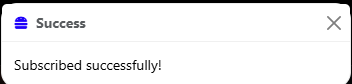
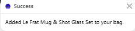

### User Feedback Messages

A custom 404 page is included to handle navigation errors, providing users with a clear message and a link back to the home page to help them continue browsing the site smoothly.


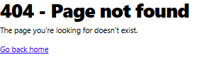

##  Web Marketing  

###  Facebook Business Page  
A Facebook page was created to help build a community around the target audience. As a free platform that is quick and easy to set up, Facebook provides an effective space for maintaining relationships with users, sharing content, and engaging directly with a large and active audience.

🔗 https://www.facebook.com/profile.php?id=61587399382148  

### Email Marketing  
Users can subscribe to a **newsletter** to receive:
- Promotions  
- New product announcements  
- Limited edition releases  

This supports **customer retention and remarketing**.

### Search engine optimization
SEO practices implemented: 
- SEO-friendly URLs  
- Optimized page metadata  
- Semantic HTML structure  
- Accessible UI components  

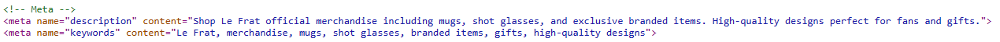

---

## Technologies

### Languages

* [CSS](https://developer.mozilla.org/en-US/docs/Web/CSS)

* [Javascript](https://www.javascript.com/)

* [Python](https://www.python.org/)

* [HTML](https://developer.mozilla.org/en-US/docs/Web/HTML)

### Frameworks, programs and libraries used

* [Stripe](https://stripe.com/en-ie) - Used to implement secure checkout functionality and process online payments.

* [Balsamiq](https://balsamiq.com/) - Used during the planning phase to create wireframes and visualise the site layout.

* [Django](https://www.djangoproject.com/) - A high-level Python web framework used to support rapid development and clean, maintainable design.

* [AWS](https://aws.amazon.com/s3/) - Used to provide object storage through a web service interface.

* [GitHub](https://github.com/) - Used for version control and to store the project repository.

* [Bootstrap4](https://getbootstrap.com/) - A CSS framework used to create a responsive and consistent user interface.

* [PostgreSQL](https://www.PostgreSQL.com/) - Used as the primary database service for the project.

* [Gitpod](https://www.gitpod.io/) - Used as the integrated development environment (IDE) during development.

* [Font Awesome](https://fontawesome.com/) - Used to provide icons for user interface elements and social media links.

* [dbdiagram](https://dbdiagram.io/home) - Used to design and document the database schema.

* [Heroku](https://www.heroku.com/) - Used as the cloud platform to deploy and host the application.

* [PEP8ci](https://pep8ci.herokuapp.com/) - Used to validate Python code against PEP8 standards.

## Testing

### Manual Testing

| Feature Area | Test | Expected Result | Actual Result |
|---|---|---|---|
| **Homepage** | Load homepage | Homepage loads with hero content and navigation | Pass |
| Homepage | Click "Shop the Drop" / "Browse All" | Redirects to product listing | Pass |
| **Navigation** | Click **Shop** in navbar | Opens products page | Pass |
| Navigation | Click **New Arrivals** in navbar | Opens product listing sorted to newest | Pass |
| Navigation | Open **Categories** menu | Category options visible (T-Shirts / Hoodies / Accessories) | Pass |
| Navigation | Select **T-Shirts** category | Filters products to T-Shirts | Pass |
| Navigation | Select **Hoodies** category | Filters products to Hoodies | Pass |
| Navigation | Select **Accessories** category | Filters products to Accessories | Pass |
| Navigation | Footer link **Support** | Opens support page | Pass |
| Navigation | Footer link **Privacy** | Opens privacy page | Pass |
| Navigation | Footer link **Terms** | Opens terms page | Pass |
| Navigation | Footer link **About Us** | Opens about page | Pass |
| Navigation | Footer link **FAQs** | Opens FAQs page | Pass |
| **Search** | Use search with valid keyword | Matching products displayed | Pass |
| Search | Use search with empty input | Returns product listing (no crash) | Pass |
| **Products Listing** | Products page loads | Products visible with name + price + view links | Pass |
| Products Listing | Sort by price low → high | Products reorder correctly | Pass |
| Products Listing | Sort by price high → low | Products reorder correctly | Pass |
| Products Listing | Sort by name A → Z | Products reorder correctly | Pass |
| Products Listing | Sort by name Z → A | Products reorder correctly | Pass |
| **Product Detail** | Open a product detail page | Product page shows title, image, price, description | Pass |
| Product Detail | Click **Back to shop** | Returns to product listing | Pass |
| Product Detail | Reviews section visible | Reviews display; prompts login to leave review | Pass |
| **Authentication** | Open **Sign Up** page | Registration form loads | Pass |
| Authentication | Register with valid details | Account created and user can log in | Pass |
| Authentication | Register with missing/invalid fields | Validation errors shown | Pass |
| Authentication | Open **Login** page | Login form loads | Pass |
| Authentication | Login with valid credentials | User logged in successfully | Pass |
| Authentication | Login with invalid credentials | Error/validation shown | Pass |
| Authentication | Logout | User logged out and redirected appropriately | Pass |
| **Bag** | Open **Bag** page | Bag page loads | Pass |
| Bag | Bag empty state | “Your bag is empty” message shown | Pass |
| Bag | Click **Go Shopping** from empty bag | Redirects to products page | Pass |
| Bag | Click **Go to Checkout** with empty bag | Redirects away (cannot checkout with empty bag) | Pass |
| Bag | Add item to bag from product detail | Success toast shown; item appears in bag | Pass |
| Bag | Add same item again | Quantity increases correctly | Pass |
| Bag | Update quantity in bag | Totals update correctly | Pass |
| Bag | Remove item from bag | Item removed and totals update | Pass |
| **Checkout** | Attempt access checkout with empty bag | Redirects to products page | Pass |
| Checkout | Checkout with items in bag | Checkout form + order summary display | Pass |
| Checkout | Submit checkout with missing fields | Form validation errors shown | Pass |
| **Payments (Stripe)** | Submit valid Stripe test payment | Payment processes successfully | Pass |
| Payments (Stripe) | Submit invalid card details | Payment blocked; error shown | Pass |
| Payments (Stripe) | Webhook confirmation (if implemented) | Order/payment state updates correctly | Pass |
| **Order Confirmation** | Complete successful payment | Confirmation shown with order details | Pass |
| **Reviews** | Logged-out user tries to leave review | Prompted to log in | Pass |
| Reviews | Logged-in user submits review (1–5 rating) | Review saved and displayed | Pass |
| Reviews | User edits own review | Changes saved correctly | Pass |
| Reviews | User deletes own review | Review removed successfully | Pass |
| Reviews | User tries edit/delete another user’s review | Action blocked / not permitted | Pass |
| **Newsletter** | Enter valid email + Subscribe | Success message shown | Pass |
| Newsletter | Enter invalid email | Validation error shown | Pass |
| Newsletter | Duplicate email subscribe | Handled gracefully (no crash) | Pass |
| **Static Info Pages** | Support page loads | Support content displays correctly | Pass |
| Static Info Pages | Privacy page loads | Privacy content displays correctly | Pass |
| Static Info Pages | Terms page loads | Terms content displays correctly | Pass |
| Static Info Pages | About Us page loads | About content displays correctly | Pass |
| Static Info Pages | FAQs page loads | FAQ content displays correctly | Pass |
| **Responsiveness** | Mobile view: homepage | Layout adapts and remains usable | Pass |
| Responsiveness | Mobile view: products page | Grid adapts without overflow | Pass |
| Responsiveness | Mobile view: bag/checkout | Content remains readable and usable | Pass |

## Functionality Testing

Throughout the development of this project, Google Chrome was used as the primary browser for testing and debugging. Chrome Developer Tools played a key role in identifying and resolving functionality-related issues, including JavaScript errors, layout problems, and performance concerns. Features were tested incrementally as they were implemented to ensure that all components behaved as expected. 

Responsive design and layout behaviour were tested using Chrome’s built-in device emulation tools, allowing the site to be evaluated across a range of screen sizes and resolutions. This helped ensure that core functionality remained consistent on both desktop and mobile views.

## Compatibility Testing

Compatibility testing was conducted to confirm that the application functions correctly across different devices and screen types. This process included the use of Chrome-emulated devices as well as physical hardware for more accurate real-world testing.

Physical devices used during testing included an iPhone 13, a Samsung A51, and a Samsung Tablet E. These tests helped verify that the user interface, navigation, and core features performed reliably across different operating systems and device form factors. Any inconsistencies identified during testing were addressed to improve overall usability and accessibility.

## Wave testing

I also tested this site on [WAVE Web Accessibility Evaluation Tool](https://wave.webaim.org/) is a set of evaluation tools which helps authors to make their web content more accessible to individuals with disabilities. WAVE can identify many accessibility and Web Content Accessibility Guideline (WCAG) errors, but also facilitates human evaluation of web content as per definition on their site.

<details>
  <summary>Homepage</summary>

  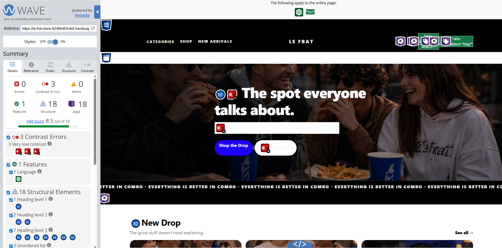

  The homepage was tested using the WAVE Web Accessibility Evaluation Tool. The results show no critical accessibility errors, with appropriate use of headings, ARIA labels, and structural elements. Minor contrast warnings were identified due to stylistic design choices, but all core content remains readable and accessible.

</details> 

<details>
<summary>About Page</summary>

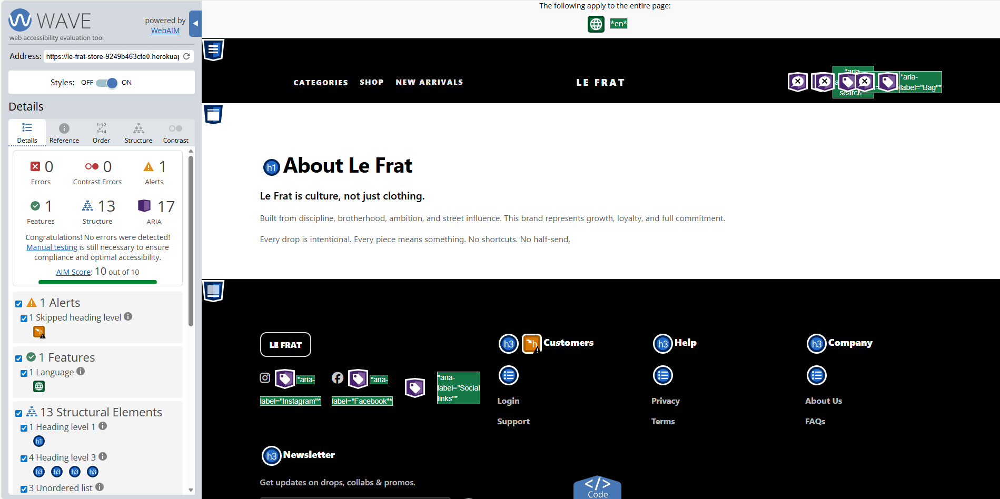

The About page achieved a high accessibility score with no detected errors. Semantic heading structure and ARIA attributes are used correctly, ensuring screen reader compatibility and clear content hierarchy.

</details> 

<details>
<summary>Privacy Page</summary>

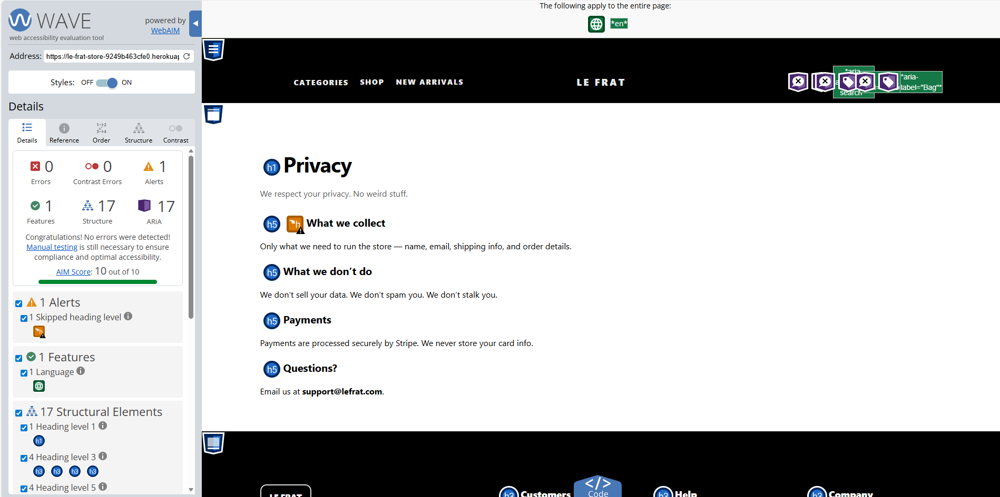

The Privacy page was tested for accessibility compliance and passed without errors. Content is clearly structured using appropriate heading levels and readable text, supporting accessibility best practices.

</details> 

<details>
<summary>Support / FAQs Page</summary>


The Support (FAQs) page uses accessible accordion components with proper ARIA controls, allowing screen readers and keyboard navigation to function correctly. No accessibility errors were detected during testing.
</details> 

<details>
<summary>Product Detail Page</summary>

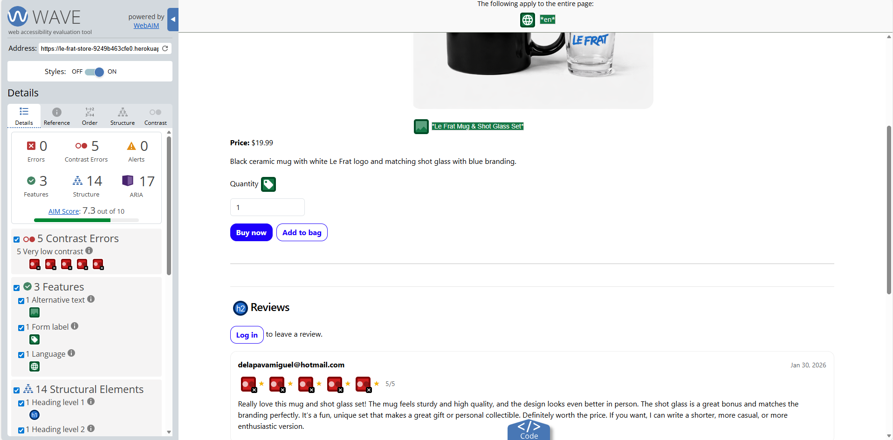

The product detail page was tested for accessibility, including image alternative text, form labels, and review sections. Some low-contrast warnings were identified due to branding colour choices; however, all essential information remains accessible and usable.
</details> 

<details>
<summary>Login Page</summary>


The login page demonstrates strong accessibility support with correctly labelled form fields, semantic headings, and ARIA attributes. No accessibility errors were detected, ensuring the page is usable for assistive technology users.
</details> 

<details>
<summary>Lighthouse results</summary>

Desktop
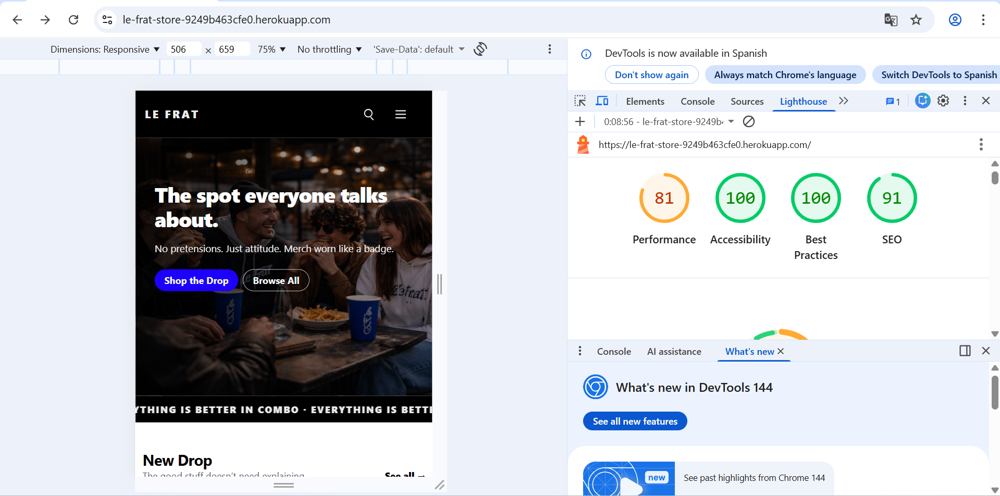
Mobile
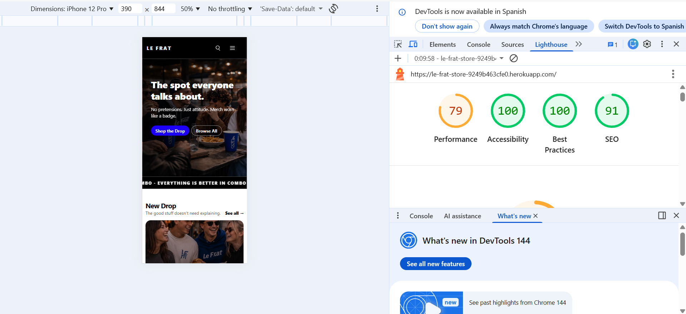
</details> 

<summary>W3C Validation</summary>

Desktop
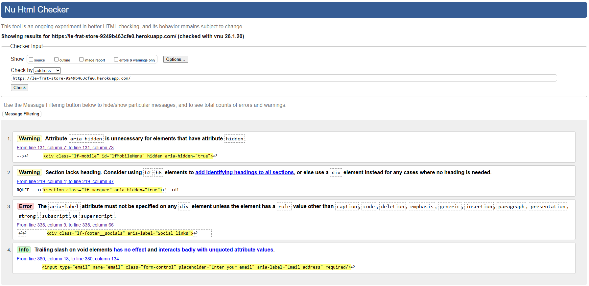

Mobile
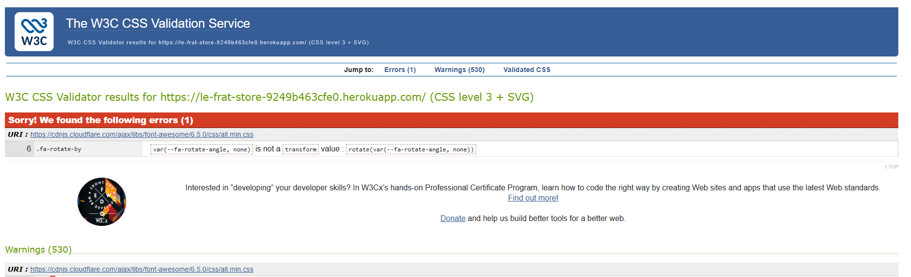

HTML and CSS were validated using W3C validation tools. Minor warnings related to accessibility best practices were identified in the HTML and have no impact on functionality. CSS validation errors originate from third-party libraries (Font Awesome) and do not affect the application’s performance or compliance.
</details> 

Accessibility testing was carried out using the WAVE Web Accessibility Evaluation Tool across multiple pages of the site. The application demonstrates strong accessibility practices through the use of semantic HTML, ARIA labels, descriptive form labels, and clear heading structures. Minor contrast warnings were identified on some pages due to design choices; however, these do not impact usability or readability of core content.

## JavaScript Validation

JavaScript code used throughout the project was validated using JSLint to identify potential errors and enforce consistent coding standards.

Several files returned warnings related primarily to JSLint’s strict style rules, such as the use of single quotes instead of double quotes and line length exceeding 80 characters. These warnings do not affect the functionality of the application.

In some cases, JSLint was unable to complete validation when third-party or embedded scripts were included. This occurred due to code structure or formatting that does not align with JSLint’s parsing expectations and is common when validating external libraries.

A summary of the validation results is provided below:

- **Navigation / Mobile Menu Script**  
  Returned multiple warnings related to the use of single quotes instead of double quotes. No functional issues were identified.

- **Checkout Script**  
  Returned warnings for line length exceeding 80 characters and syntax formatting. Some warnings were caused by Stripe-related code and embedded scripts.

- **Newsletter Script**  
  Returned warnings due to third-party code sourced directly from Mailchimp. This code was not modified.

- **Bootstrap JavaScript (CDN)**  
  JSLint was unable to complete validation due to external library syntax. This code is maintained by Bootstrap and was not altered.

- **Base Template Scripts**  
  No warnings were reported.

Overall, all JavaScript functionality operates as intended. Reported warnings are related to stylistic preferences or third-party code and do not impact site performance or user experience.


### Python
[ CI Python linter ](https://pep8ci.herokuapp.com/) was used to test python code

## Bugs
## 🐞 Known Bugs

### Bug 1 – Incorrect Heading on Shop Page
**Issue:**  
When selecting **Shop** from the navigation menu, the products page loads correctly but still displays the heading **“New Arrivals”**, which may cause confusion for users.

**Cause:**  
The same template is used for both the general products view and the “New Arrivals” view without dynamically changing the heading based on the selected option.

**Planned Fix:**  
Update the template logic to display a different heading depending on the selected navigation option or query parameters.

---

### Bug 2 – Reviewer Email Address Displayed Publicly
**Issue:**  
Product reviews currently display the reviewer’s email address publicly on the product detail page.

**Cause:**  
The review template renders the user’s email field instead of a safer identifier.

**Planned Fix:**  
Replace the displayed email address with the user’s username or a generic label such as *“Verified Customer”* to protect user privacy.

---

### Bug 3 – Low Contrast Accessibility Warnings
**Issue:**  
Accessibility testing using the WAVE tool identified low-contrast warnings on some buttons and text elements, particularly on product detail pages.

**Cause:**  
Certain brand colour combinations do not provide sufficient contrast between text and background.

**Planned Fix:**  
Adjust colour contrast for affected UI elements while maintaining the overall brand identity to improve accessibility compliance.

---
## 🚀 Deployment

This project was developed using Gitpod with Git for version control and deployed to **Heroku**.  
A **Code Institute PostgreSQL database** was used for the production environment.

### Heroku Deployment Steps

1. Log in to **Heroku** (or create an account if required).
2. From the Heroku dashboard, click **New** → **Create New App**.
3. Enter a unique application name.
4. Select **Europe** as the region.
5. Click **Create App**.

---

### Database Setup (Code Institute PostgreSQL)

This project uses the **Code Institute PostgreSQL database service**.

1. Navigate to:  
   https://dbs.ci-dbs.net/
2. Create a new PostgreSQL database instance.
3. Copy the provided **DATABASE_URL**.

---

### Environment Configuration

1. In Heroku, open your app and go to **Settings**.
2. Click **Reveal Config Vars**.
3. Add the following environment variables:

   - `DATABASE_URL` → paste the PostgreSQL database URL from dbs.ci-dbs.net
   - `SECRET_KEY` → your Django secret key
   - `STRIPE_PUBLIC_KEY`
   - `STRIPE_SECRET_KEY`
   - `STRIPE_WH_SECRET`
   - `DISABLE_COLLECTSTATIC` → `1` (for initial deployment)

4. In your project, ensure `dj_database_url` is installed and imported in `settings.py`.
5. Update `settings.py` to use the production database when `DATABASE_URL` is present.

---

### Migrations & Requirements

1. Install PostgreSQL dependencies:
   ```bash
   pip3 install psycopg2-binary

2. Freeze project dependencies:
    ```bash
pip3 freeze > requirements.txt

3. Apply database migrations:
    ```bash
python3 manage.py migrate

4. Create a superuser:
    ```bash
python3 manage.py createsuperuser

> ⚠️ **Note**  
Ensure that sensitive information such as `SECRET_KEY` values and database credentials are never committed to GitHub.

## Final Deployment

1. Install **Gunicorn**, which will be used as the production web server:
    ```bash
pip3 install gunicorn

2. Create a `Procfile` in the root directory of the project and add the following line:
    ```bash
web: gunicorn <project_name>.wsgi


3. Commit all changes and push them to your GitHub repository.

4. Log in to **Heroku** and navigate to the **Deploy** section of your application dashboard.

5. Connect the Heroku app to the appropriate GitHub repository.

6. Select either **Manual Deploy** or **Automatic Deploy**, depending on preference.

7. Click **Deploy Branch** to begin the deployment process.

8. Once deployment is complete, select **View** to open the live application.

## Forking the Repository

1. Navigate to the GitHub page containing the repository.
2. Click the **Fork** button located in the top-right corner of the page.
3. Once the process is complete, a copy of the repository will be created in your own GitHub account.

## Cloning the Repository

1. Open the repository page on GitHub.
2. Click the green **Code** button.
3. Copy the repository URL from the **HTTPS** tab.
4. Alternatively, you may download the repository as a ZIP file, extract it locally, and open it in your preferred IDE.
5. To clone using Git, open a terminal or command prompt.
6. Navigate to the directory where you would like the project to be stored.
7. Run the following command, replacing the URL with the one copied from GitHub:

---


## Credits

### Media
- Some images featuring people used throughout the site were **AI-generated** for design and branding purposes.

### Branding & Merchandise
- The **Le Frat branding, logos, and merchandise designs** were created by:  
  https://www.maquinados.co/

### Code & Learning Resources
- Code Institute **Boutique Ado** walkthrough
- [DataFlair Django tutorials](https://data-flair.training/blogs/django-tutorials-home/)
- Stack Overflow for troubleshooting and reference


### Blog Content Inspiration
- [Weedgreen](https://weedgreen.com/en)
- [Fullsend](https://fullsend.com/)
- [True](https://trueshop.co/?utm_term=true&utm_campaign=TRUE_SEM_CPC_PB&utm_source=adwords&utm_medium=ppc&hsa_acc=9245374731&hsa_cam=17477674933&hsa_grp=136098743005&hsa_ad=617272709203&hsa_src=g&hsa_tgt=kwd-321791485&hsa_kw=true&hsa_mt=e&hsa_net=adwords&hsa_ver=3&gad_source=1&gad_campaignid=17477674933&gbraid=0AAAAABRpsmZv6osjB4ZlH7ilvgJABJ6BF&gclid=Cj0KCQiAyvHLBhDlARIsAHxl6xrBi89WKCr0E4BrjKJ3MTamWOThwSTBdsvz8VrziAUEaHhjRXpv7k4aAqrNEALw_wcB
)

### Acknowledgements
- Special thanks to my **Code Institute mentor Jubril Akolade** for guidance, feedback, and support throughout the development of this project.
- Code Institute  
- Django & Stripe Documentation  

